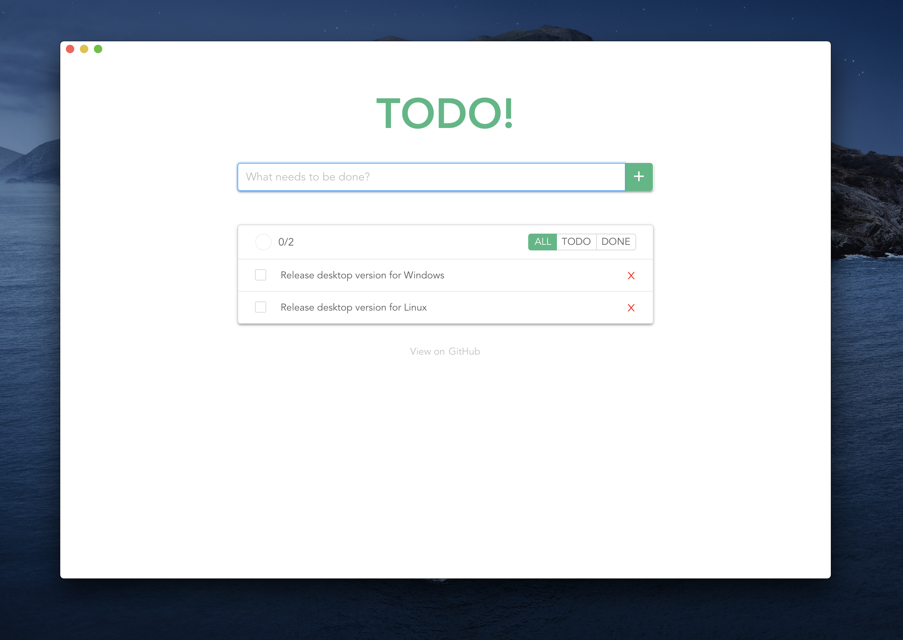

# TODO! Desktop

You can download [here](https://github.com/yungshenglu/TODO-Desktop/releases)! :tada:

This repository is my practice to implement a simple TODO-list with Vue/Vuex into desktop using Electron. For now, we have a Beta version (v0.1.0) that enables users to add, remove, edit, and check your items in the TODO-list. Besides, we also provide a very simple classification for the status of each item (i.e, todo, done)

> **HINT:** If you have any questions, please feel free to ask me.

---

## Descriptions

### Execution

(To be updated.)

### Implementation

(To be updated.)

#### Prerequisite

(To be updated.)

#### Release on GitHub

(To be updated.)

---

## Contributor

> **NOTICE:** You can follow the contributing process [CONTRIBUTING.md](CONTRIBUTING.md) to join me. I am very welcome for any issue!

- [David Lu](https://github.com/yungshenglu)

---

## License

[GNU GENERAL PUBLIC LICENSE Version 3](LICENSE)
